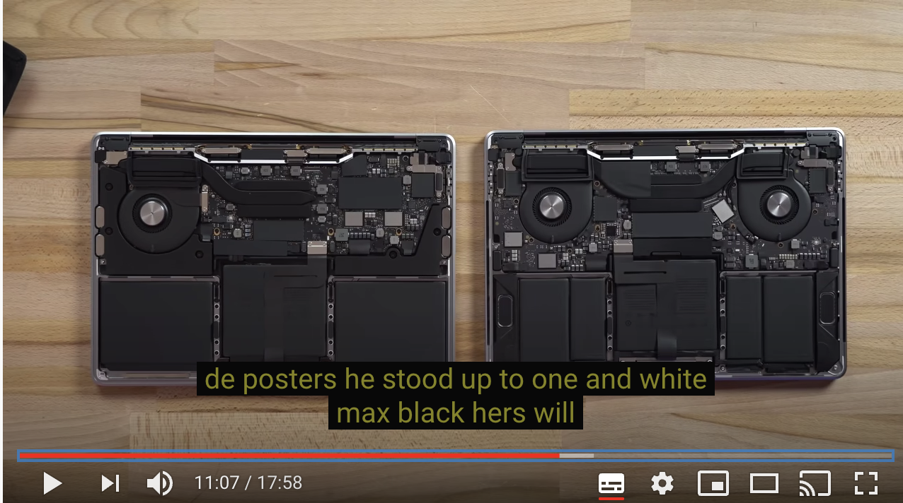
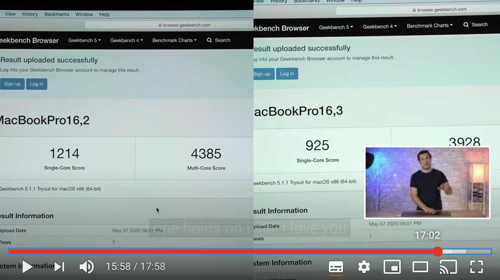

## buy macbook pro 2020 version

底下優惠都可以一起使用
* Back to School (20200709~20200908左右)
   * 送 airpod 2  (5290)
   * 92折 
* Line Store 進入到 apple 網站 (20200710 這一天而已, 其他天都5%, 不知道可以有多久)
    * 10%
* Credit Card 回饋 (2020整年的信用卡都有)
    * 2%

20200710 22:00 左右購買, 要求2天內傳送購買教育價資格文件, 而且收件人必須是哪一個學生
20200715 收到扣款通知

購買原價 63900 變成 60700, 然後省掉耳機的 5290
airpod 是 5290, 但我升級airpod pro 版本 7990 (多花了2700)
這樣總共 55410 +7990 = 63400

63900 + 7990 = 71890 => 0.88 折
12% line point = 7608
63400 - 7608 =  55792 
55792/71890 = 0.77 折
這應該是目前知道的最便宜的價格. 如果在costco 買是差不多95折, 使用costco卡也頂多回饋1%, 變94折.

### 到 studio A 購買 macbook pro 2020 版本

底下優惠都可以一起使用
* BTS
* 滿萬送500
* apple-care+ 打八折 (9500 * 0.8)
* 信用卡回饋2%

這樣算下來也是差不多, 但是沒有 line store 進去買的10% line point 回饋.

### 2020 MBP 效能比較

youtube 有比較的
[https://www.youtube.com/watch?v=jK3AOK8uDJo](https://www.youtube.com/watch?v=jK3AOK8uDJo)

cpu 有差別

拆開的風扇數量有差別

跑benchmark app有差別

### arm macbook pro 預期的效能
這邊有個技術上的講解比較

像是目前a12x  arm 使用的是 7nanometer 技術
如果照比較圖表, 一但使用了 5 or 3 nm 技術生產
硬體架構都不改, 就可以有效能跟省電上的提升
這個約在影片的5:54分講解
[https://www.youtube.com/watch?v=ZtO2z5JATVU](https://www.youtube.com/watch?v=ZtO2z5JATVU)

另外本來apple 請其他GPU廠商特別提供GPU特殊版本
也可以使用apple 自已的版本
可以整合進CPU裡面, 讓CPU & GPU 直接溝通, 不用中間的cache 處理, 減少 path 上的latency
這個約在影片2:49分的時候講解

另外在目前cpu 的比較數值上, 的確 intel CPU 比較好看, 配合的GPU 也數值驚人
但是一但對比ipad pro同樣的影片剪輯, 加上特別的指令集(??)
反而處理的速度更快了, 這代表數字不能真實的表現出實際使用上的感覺
這個約在影片8:15 分的時候講解

[https://www.youtube.com/watch?v=ZtO2z5JATVU](https://www.youtube.com/watch?v=ZtO2z5JATVU)

<!--stackedit_data:
eyJoaXN0b3J5IjpbLTE1OTUxNjU5NzMsLTg2NTUzODMwNiwtOD
kyNTI1NzMwLDQ3ODE2NTkwOCwtNTY3MzU5MTEyXX0=
-->